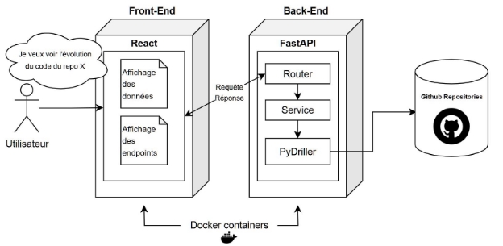

# Document de conception

**Auteurs** : Cédric Audy, Julien Boisvert-Simard, Félix Dufresne

Dans le cadre de LOG795 – Projet de fin d’étude

*4 juillet 2024*

---

## Introduction

Le présent document vise à présenter la conception logicielle de l’outil de visualisation interactive de l’évolution du code des logiciels sur GitHub du PFE028.

Cet outil doit permettre à un utilisateur de choisir un repository sur la plateforme de versionnage GitHub, et d’aller chercher des informations sur l’évolution du code source de commit en commit: quels fichiers (et de quels types sont-ils) ont été modifiés, des lignes y ont-elles été ajoutées et/ou supprimées, etc.

Ces informations sont présentées sous la forme d’un tableau à deux axes -- commits (ou dates), et identificateur du fichier -- populé de points colorés selon un code prédéfini (rouge pour suppression de lignes, vert pour ajout, etc.).

Nous expliquerons les choix faits au niveau de l’infrastructure, des méthodes de travail, des langages de programmation, des cadriciels ainsi que des librairies utilisées.

## Vue de haut-niveau

L’architecture de ce projet prend la forme d’une application web typique : front-end, back-end. Bien que le projet n’exige pas un site web en tant que tel, celui-ci se prête bien à un découpage des tâches de ce type, autant au niveau du développement qu’au niveau de l’architecture et de la mise en échelle de la solution (scaling).

Le front-end servira à présenter à l’utilisateur les fonctionnalités disponibles, puis à présenter les données sous la forme de tableaux et de statistiques. Le front-end envoie des requêtes auprès du back-end, puis reçoit les informations demandées sur le repo et ses commits qu’il affiche ensuite.

Le back-end s’occupe de recevoir les requêtes du front-end et de les router vers le service permettant d’aller extraire l’information sur GitHub. Une fois l’information extraite, celle-ci est traitée et renvoyée au front-end.

## Infrastructure

Dans l’optique de respecter l’architecture full-stack, le front-end et le back-end rouleront dans deux conteneurs Docker différents. Cela permet une séparation du travail et des dépendances. Une entreprise pourra donc déployer la solution dans l’environnement de son choix (serveur, machine virtuelle, plateforme cloud, etc.), mais un utilisateur aura aussi l’option de déployer l’application sur sa station de travail (pourvu qu’il dispose de Docker ou bien d’un environnement unix-based).

## Choix de langages de programmation, cadriciels, librairies

**Front-end** : le cadriciel React (TypeScript) sera utilisé pour la programmation dynamique de l'interface utilisateur, conjointement avec HTML/CSS. La bibliothèque Recharts permet la création de graphiques sous forme de composants React. Enfin, le cadriciel TailwindCSS permet de modifier rapidement le layout d'une page HTML.

**Back-end** : le cadriciel FastAPI (Python 3) sera utilisé pour la programmation de l’API, et se chargera des routes, des requêtes, de la sécurité, etc. L’API fera appel à une librairie Python nommée PyDriller qui se charge d’extraire l’information à partir de GitHub; celle-ci clone localement un repository et offre une interface pour interagir avec les commits de celui-ci.

## Pipeline d’intégration continue

Dans le but d’accélérer et faciliter le développement, un pipeline GitHub Actions de base a été mis en place afin que chaque push sur nos repositories de développement déclenche un build Docker ainsi qu’un dépôt de la nouvelle image sur Docker Hub (il suffit ensuite de se connecter à Docker et de pull les images pour déployer l’application à l’endroit désiré). Des étapes pourront être ajoutées par la suite : linting, suite de tests, déploiement automatique sur des infrastructures désignées, envoi de courriels, etc.

## Diagramme

Ce diagramme vise à donner une vue de haut-niveau de l’application envisagée.

## Classification des fichiers et limitations

### Classification des fichiers

Actuellement, la classification des fichiers se fait uniquement par l'extension du fichier. Voici un exemple de la classification en fonction des extensions de fichier :

- .py : Code source Python
- .js : Code source JavaScript
- .html : Fichier HTML
- .css : Feuille de style CSS
- .md : Documentation Markdown
- .json : Fichier de configuration JSON

### Limitations

#### Fiabilité de la classification par extension

L'utilisation des extensions de fichier pour la classification présente certaines limitations :

- **Non-standardisation** : Certains projets peuvent utiliser des extensions de fichier non standard ou personnalisées, rendant la classification moins fiable.
- **Multifonctionnalité** : Une même extension de fichier peut être utilisée pour différents types de contenu. Par exemple, un fichier `.txt` peut contenir des notes de documentation, des scripts de configuration ou d'autres types de données.

#### Alternatives à l'extraction par extension

Pour améliorer la classification des fichiers, nous pourrions envisager les alternatives suivantes :

- **Analyse du contenu** : Lire le contenu des fichiers pour déterminer leur type en analysant les premières lignes ou en recherchant des motifs spécifiques. Cette méthode est plus précise mais peut être coûteuse en termes de temps de traitement, surtout pour les grands repositories.
- **Métadonnées du repository** : Utiliser les métadonnées disponibles dans le repository (comme les fichiers README ou les fichiers de configuration) pour améliorer la classification des fichiers. Cela nécessite une extraction et une analyse supplémentaires des métadonnées.
- **Apprentissage automatique** : Mettre en place des modèles d'apprentissage automatique pour classer les fichiers en fonction de leur contenu et de leur extension. Cela nécessite la collecte de données d'entraînement et la mise en œuvre d'algorithmes de classification.

## Assomptions et contraintes

- **Assomptions** :
  - Les projets suivent les conventions de nommage standard pour les extensions de fichier.
  - Les extensions de fichier fournissent une indication suffisante du type de contenu dans la majorité des cas.
  
- **Contraintes** :
  - L'ouverture et l'analyse de chaque fichier pour déterminer son type peuvent être longues et coûteuses en ressources.
  - La mise en œuvre d'algorithmes d'apprentissage automatique nécessite des ressources supplémentaires et une gestion des données d'entraînement.

En gardant ces limitations et assomptions à l'esprit, nous continuerons à améliorer notre méthode de classification pour offrir une visualisation précise et utile de l'évolution des projets sur GitHub.
