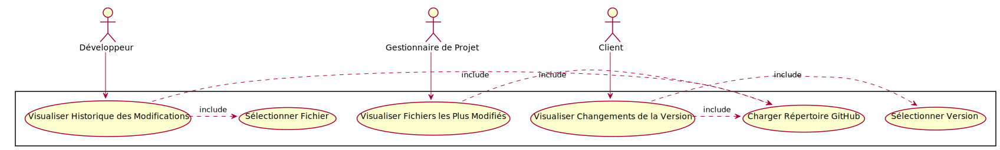

# Document SRS PFE Été 2024

## Auteurs
- Julien Boisvert-Simard - DUFF08079701
- Cédric Audy - AUDC08089302
- Félix Dufresne - DUFF08079701

## Dans le cadre de 
LOG795 – Projet de fin d’étude 

## Introduction

### Objectif de ce Document
Ce document a pour but de fournir une spécification des exigences logicielles (SRS) pour le développement d'un outil de visualisation interactive de l’évolution du code des logiciels sur GitHub. Il vise à définir les besoins et les fonctionnalités du projet, à clarifier les attentes des utilisateurs, et à servir de référence pour le développement et la validation du produit.

### Portée de ce Document
Ce document couvre les fonctionnalités principales de l'outil, les exigences fonctionnelles et non-fonctionnelles, les interfaces utilisateur, ainsi que les contraintes de conception. Il décrit également le contexte et la motivation du projet, l'environnement opérationnel et les utilisateurs cibles. Il inclut une estimation du temps requis.

### Aperçu du Projet
Le projet vise à développer un outil permettant de visualiser l’évolution des changements des différents types de fichiers de code au niveau des commits sur GitHub. Il identifiera visuellement les fichiers ajoutés, les types de fichiers modifiés, la fréquence des changements, la stabilité des fichiers, et les fichiers modifiés simultanément. L'outil apportera des informations pertinentes pour les gestionnaires de projet, les développeurs et les clients afin de comprendre l'historique d'évolution du code.

## Description Générale

### Contexte et Motivation
Les systèmes de gestion de versions, comme GitHub, sont largement utilisés pour la collaboration dans les projets de développement logiciel. Cependant, malgré leur efficacité pour le contrôle de version et la gestion des branches, ils offrent des fonctionnalités limitées pour la visualisation des changements au fil du temps. Cela pose un défi pour les développeurs et les gestionnaires de projets qui souhaitent analyser les tendances, comprendre l'évolution du code et identifier rapidement les zones de modifications fréquentes ou les contributions clés. Une solution robuste de visualisation des données peut grandement améliorer la compréhension et la gestion du cycle de vie du développement logiciel.

Notre mission consiste donc à développer une solution permettant de collecter et de visualiser les données relatives à l'évolution du code source dans un répertoire Git.

### Objectifs du Projet
Dans ce projet, nous nous engageons à développer un outil innovant permettant de visualiser l’évolution des changements de code source au niveau des commits dans les systèmes de contrôle de versions. Notre objectif principal est de fournir aux gestionnaires de projet, aux développeurs et aux clients une compréhension claire et détaillée des modifications du code source au fil du temps.

### Retombées du Projet
- **Amélioration de la gestion de projet** :
  - Les gestionnaires de projet pourront mieux comprendre et anticiper les besoins en termes de développement et de maintenance grâce à une visualisation claire des tendances de modification du code.
  - Identification des parties du code nécessitant une attention particulière ou une refactorisation.
- **Efficacité accrue des développeurs** :
  - Les développeurs pourront rapidement identifier les parties du code les plus sensibles et les plus modifiées, facilitant ainsi le développement et le débogage.
  - Facilitation de la coordination entre les membres de l'équipe grâce à une meilleure compréhension des interdépendances entre les fichiers.
- **Satisfaction accrue des clients** :
  - La visualisation des progrès et des modifications, ainsi que la transparence accrue du projet, apporteront une meilleure compréhension de l’état d’avancement du projet et renforceront la satisfaction et la confiance des clients.

### Méthodologie
Pour atteindre les objectifs de ce projet, nous adopterons une méthodologie agile, ce qui nous permettra d'être flexibles et adaptatifs face aux changements et aux défis rencontrés au cours du développement. Nous utiliserons la méthode Kanban pour gérer et visualiser les tâches à accomplir et nous tiendrons des réunions hebdomadaires pour identifier et résoudre les obstacles. Les échéanciers seront aussi revus chaque semaine afin de les respecter le plus possible et de s’adapter le plus rapidement possible en cas de changement.

## Exigences Fonctionnelles

### Description Détaillée des Fonctionnalités
1. **Visualisation des Commits**
   - Afficher un graphique permettant la visualisation des modifications de fichiers dans un répertoire GitHub public.
   - Permettre de filtrer et de trier les commits par date et type de fichier.

2. **Identification des Types de Modifications**
   - Marquer visuellement les ajouts, suppressions et modifications de fichiers.
   - Afficher des résumés des changements pour chaque commit.

3. **Visualisation des Types de Fichiers Modifiés**
   - Classer les fichiers modifiés par type (code de production, code de test, configuration, documentation).
   - Fournir des graphiques montrant la répartition des types de fichiers modifiés au fil du temps.

4. **Fréquence des Changements et Stabilité des Fichiers**
   - Afficher des graphiques montrant la fréquence des changements de chaque fichier.
   - Identifier les fichiers les plus stables et les plus modifiés.

5. **Changements Simultanés de Fichiers**
   - Visualiser les fichiers modifiés ensemble dans le même commit.
   - Permettre d'identifier les dépendances entre fichiers.

### Scénarios d'Utilisation (Use Cases)

**Diagramme de Cas d'Utilisation** :

#### 1. Comprendre l'historique des modifications d'un fichier spécifique

**Description** : Un développeur souhaite comprendre l'historique des modifications d'un fichier spécifique pour identifier les changements effectués, par qui et quand.

**Acteurs** : Développeur

**Préconditions** :
- Le répertoire GitHub est déjà chargé dans l'application.

**Postconditions** :
- Le développeur peut visualiser l'historique des modifications du fichier sélectionné.

**Cas de Variations** :
- Le fichier n'existe pas dans le répertoire.
- Le développeur n'a pas les droits d'accès au répertoire.

#### 2. Identifier les fichiers les plus modifiés pour évaluer les zones de risque du projet

**Description** : Un gestionnaire de projet souhaite identifier les fichiers les plus modifiés pour évaluer les zones de risque du projet.

**Acteurs** : Gestionnaire de Projet

**Préconditions** :
- Le répertoire GitHub est déjà chargé dans l'application.

**Postconditions** :
- Le gestionnaire de projet peut visualiser les fichiers les plus modifiés et évaluer les zones de risque.

**Cas de Variations** :
- Le gestionnaire n'a pas les droits d'accès au répertoire.
- Les données de modification ne sont pas disponibles.

#### 3. Obtenir une vue d'ensemble des changements apportés à une version du logiciel

**Description** : Un client souhaite obtenir une vue d'ensemble des changements apportés à une version du logiciel pour comprendre les améliorations et les correctifs.

**Acteurs** : Client

**Préconditions** :
- Le répertoire GitHub est déjà chargé dans l'application.

**Postconditions** :
- Le client peut visualiser les changements apportés à une version du logiciel.

**Cas de Variations** :
- Le client n'a pas les droits d'accès au répertoire.
- La version du logiciel n'est pas disponible.

## Exigences d'Interface

### Interfaces Utilisateur
L'interface utilisateur sera une application web interactive avec des éléments graphiques pour visualiser les données des commits. Elle comprendra :
- Un champ permettant d'entrer l'URL du répertoire GitHub à visualiser.
- Des champs permettant de filtrer les commits.
- Un graphique permettant la visualisation des modifications.
  - L'axe des x contient les commits.
  - L'axe des y contient les fichiers.
  - Un point sur le graphique représente un ajout, une modification ou une suppression.
  - Au survol d'un point sur le graphique, une section contenant le nom du fichier, le nombre de lignes ajoutées et le nombre de lignes supprimées s'affiche.
  - Les cellules sont séparées par type via leur couleur :
    - Source Ajouté
    - Source Modifié
    - Test Ajouté
    - Test Modifié
    - Base de Données Ajoutée
    - Base de Données Modifiée
    - Documentation Ajoutée
    - Documentation Modifiée
  - Une légende contenant les différents types ainsi que leur couleur.
 

### Interfaces Matériel et Logiciel
- Utilisation de la librairie PyDriller pour extraire les données des commits de Git.
- Utilisation de librairies javascript pour la visualization des données:
  - [React.js](https://react.dev/)
  - [Recharts](https://recharts.org/en-US/)
  - [TailwindCSS](https://tailwindcss.com/)
- L'application sera déployée et exécutée dans des conteneurs Docker pour assurer une portabilité et une isolation des environnements.

## Exigences de Performance

### Temps de Réponse et Efficacité
L'outil doit fournir des temps de réponse rapides lors du chargement et de l'affichage des données des commits. Les graphiques interactifs doivent se mettre à jour en temps réel lors de l'application des filtres.

### Contraintes de Capacité
L'outil doit être capable de gérer de grands volumes de données de commits sans perte de performance. Il doit être testé avec des projets GitHub de grande taille pour assurer son efficacité.

## Contraintes de Conception

### Limites Techniques et de Technologie
- Utilisation de la librairie PyDriller pour accéder aux données des commits.
- Développement de l'interface utilisateur en utilisant des technologies web modernes comme React.js.
- Hébergement de l'application sur une plateforme cloud compatible avec les standards open source.
- Déploiement de l'application en utilisant Docker pour une meilleure gestion des environnements et une portabilité accrue.

## Attributs Non-Fonctionnels

### Sécurité
L'application doit garantir la sécurité des données des utilisateurs et protéger l'accès aux informations sensibles des projets GitHub.

### Portabilité
L'application doit être compatible avec les principaux navigateurs web et fonctionnelle sur différentes plateformes (desktop, mobile). L'utilisation de Docker permet de garantir que l'application peut être facilement déployée et exécutée sur différents environnements sans problème de compatibilité.

### Fiabilité et Disponibilité
L'application doit être fiable et disponible à tout moment, avec un minimum de temps d'arrêt.

### Scalabilité
L'application doit pouvoir évoluer pour gérer une augmentation du nombre d'utilisateurs et de projets GitHub.

## Planification Préliminaire et Budget

### Estimation du Temps de Développement
Le développement du projet est estimé à environ 6 mois, comprenant les phases de conception, de développement, de test et de déploiement.

### Estimation des Coûts
Aucun coût ne sera relié au développement de l'application dans le contexte de notre PFE.

## Annexes

### Références
- PyDriller : https://pydriller.readthedocs.io/en/latest/#
- Recharts : https://recharts.org/en-US/
- React : https://fr.react.dev/
- TailwindCSS : https://tailwindcss.com/
- SRS document by GeeksForGeeks : https://www.geeksforgeeks.org/software-requirement-specification-srs-format/#introduction
- FastAPI : https://fastapi.tiangolo.com/
- GitHub Action : https://docs.github.com/fr/actions
- Docker : https://www.docker.com/

### Définitions des Termes
- **Commit** : Unité de modification enregistrée dans un système de contrôle de versions.
- **GitHub** : Plateforme de gestion de versions et de collaboration pour le développement de logiciels.
- **API** : Interface de programmation permettant à des applications de communiquer entre elles.
